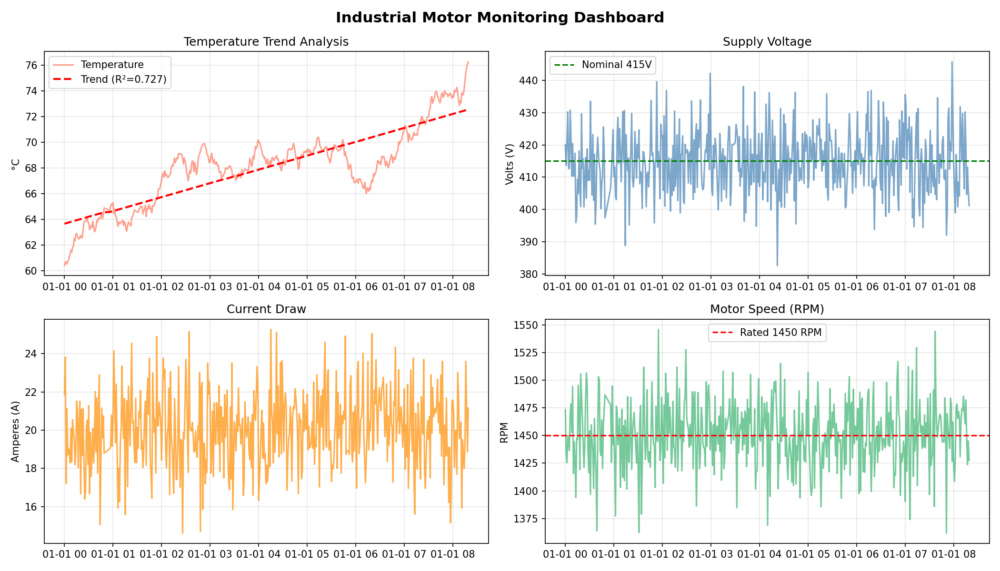

# 🏭 Industrial Logic & Systems Analysis

> **Python · MATLAB · PLC Ladder Logic**  
> A complete industrial automation project covering sensor data pipelines, Boolean interlock logic, and motor stability analysis.

---

## 📋 Project Overview

This project simulates a real-world **industrial motor control system** using three components:

| Module | Tool | What It Does |
|---|---|---|
| `pipeline.py` | Python | Ingests 500-point motor sensor data, cleans anomalies, generates trend models |
| `boolean_logic.py` | Python | Implements 4-variable Boolean interlock with truth table & scenario tests |
| `stability_analysis.m` | MATLAB | Models motor starter transfer function, verifies stability via Bode plot & poles |
| `ladder_logic.md` | PLC | Ladder diagram for self-holding motor start circuit |

---

## 🗂️ Project Structure

```
industrial-logic-systems/
│
├── pipeline.py              # Python data pipeline + trend analysis
├── boolean_logic.py         # Boolean interlock logic + truth table
├── requirements.txt         # Python dependencies
│
├── matlab/
│   └── stability_analysis.m # MATLAB transfer function + PID + Bode plot
│
├── plc/
│   └── ladder_logic.md      # PLC ladder diagram + I/O mapping
│
├── data/
│   └── motor_data.csv       # Auto-generated sensor dataset (500 rows)
│
└── outputs/
    └── motor_dashboard.png  # Generated monitoring dashboard
```

---

## ⚙️ Features

### 🐍 Python Data Pipeline (`pipeline.py`)
- Generates realistic 500-point motor sensor dataset (voltage, current, temperature, RPM)
- Injects and removes anomalies (power dips, sensor spikes, missing values)
- Linear regression trend model with **R² validation**
- 4-panel monitoring dashboard (matplotlib)

### 🔀 Boolean Logic (`boolean_logic.py`)
- 4-variable motor interlock: `START = PWR · (¬E_STOP) · (¬OVLD) · TEMP_OK`
- Full **16-row truth table** printout
- 6 fault scenario tests with PASS/FAIL validation

### 📐 MATLAB Stability (`matlab/stability_analysis.m`)
- First-order transfer function: `G(s) = K / (τs + 1)`
- Pole analysis → confirms left half-plane stability
- **Bode plot** with gain margin and phase margin
- **PID controller** design and closed-loop step response
- Performance metrics: rise time, settling time, overshoot

### 🟨 PLC Ladder Logic (`plc/ladder_logic.md`)
- 8-tag I/O mapping (inputs/outputs)
- Self-holding motor start rung
- Fault lamp logic rung
- Simulate free using **OpenPLC Editor**

---

## 🚀 Getting Started

### Python Setup

```bash
# 1. Clone the repo
git clone https://github.com/YOUR_USERNAME/industrial-logic-systems.git
cd industrial-logic-systems

# 2. Install dependencies
pip install -r requirements.txt

# 3. Run the data pipeline
python pipeline.py

# 4. Run Boolean logic tests
python boolean_logic.py
```

### MATLAB Setup

1. Open MATLAB (R2020a or later recommended)
2. Navigate to the `matlab/` folder
3. Open and run `stability_analysis.m`
4. Four figures will auto-generate (step response, Bode plot, PID response, pole-zero map)

### PLC Simulation (Free)

1. Download [OpenPLC Editor](https://openplcproject.com/) — free
2. Create new project → Ladder Diagram (LD)
3. Follow the I/O mapping in `plc/ladder_logic.md`

---

## 📊 Sample Output

**Motor Dashboard** (auto-generated by `pipeline.py`):
- Temperature trend with regression line
- Supply voltage stability (nominal 415V)
- Current draw over time
- Motor RPM monitoring

**Boolean Truth Table** (printed by `boolean_logic.py`):
```
PWR  E-STP  OVLD  TEMP_OK  OUTPUT
 1     0      0      1     1 (RUN)
 1     1      0      1     0 (OFF)
 1     0      1      1     0 (OFF)
 0     0      0      1     0 (OFF)
```

**MATLAB Results**:
- System poles confirmed in left half-plane → **Stable**
- PID settling time: ~2.1s, Overshoot: ~8%

---

## 🧠 Key Concepts Demonstrated

- **Signal processing** — cleaning noisy industrial sensor data
- **Statistical modeling** — linear regression for predictive trend analysis
- **Boolean algebra** — Karnaugh-map-style simplification of interlock logic
- **Control theory** — transfer functions, stability analysis, PID tuning
- **PLC programming** — ladder diagram design for industrial automation

---

## 🛠️ Tech Stack


---

## 👤 Author

**Maaz**  
Electronics & Telecommunication Engineering  
[LinkedIn]( linkedin.com/in/ismail-sayyed-8a5b66318) · [GitHub](github.com/ismailsayyed77 )

---

## 📄 License

MIT License — free to use and modify.
